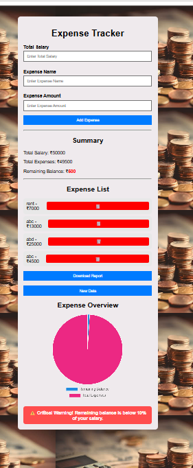
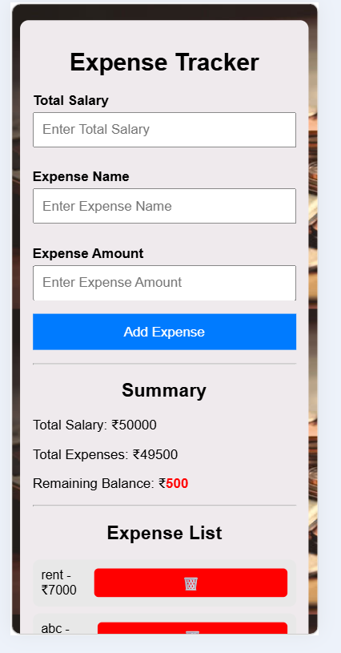
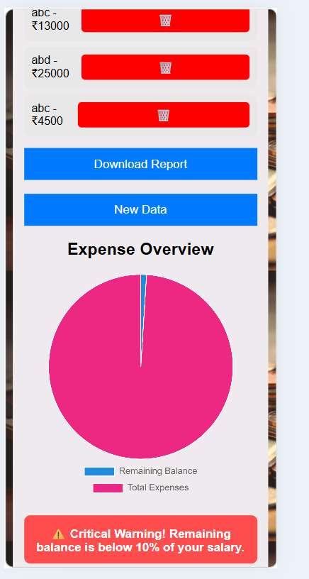

# 💰 Expense Tracker

A responsive Expense Tracker web application built using **HTML, CSS, and JavaScript**. It helps users manage their income and expenses, calculate the remaining balance, visualize spending through charts, generate PDF reports, and securely store data using LocalStorage.

---

## 🚀 Features

- 💵 Add Total Salary
- 📝 Add Expense Name and Expense Amount
- ✅ Form Validation
   - Prevents empty inputs
   - Prevents negative values
   - Prevents expenses greater than salary
- 📋 Dynamic Expense List
- 🗑️ Delete Expense
- 📊 Automatic Calculation
   - Total Expenses
   - Remaining Balance
- 💾 LocalStorage Integration
   - Saves salary and expenses
   - Restores data after page reload
- 📈 Pie Chart Visualisation using Chart.js
- 🗒️ Download Expense Report as PDF using jsPDF         
- ⚠️ Low Balance Alert
   - Displays a warning when the remaining balance falls below 10% of the total salary.
- 🆕 New Data Button
  - Clears all stored data and starts a new session

---

## ⚙️👩‍💻 Technologies Used
 
 - HTML
 - CSS
 - JavaScript
 - Chart.js
 - jsPDF
 - LoacalStorage

---

## 📂 Project Structure

```
Expense-Tracker/
|-- index.html
|-- style.css
|-- script.js
|-- README.md
|-- Prompt.md
```

---

## 📓 How to Use

1. Enter your Total Salary.
2. Enter an Expense Name.
3. Enter the Expense Amount.
4. Click **Add Expense**.
5. View:
  - Salary
  - Expense List
  - Total Expenses 
  - Remaining Balance
6. Delete expenses using the trash icon.
7. Change the currency using the dropdown.
8. Download a PDF report.
9. Click **New Data** to clear all saved data.

--

## 📊 Features Overview

### Salary Management
- Stores and displays the total salary.

### Expense Management
- Add unlimited expenses.
- Delete expenses instantly.
- Automatically updates totals.

### LocalStorage
- Saves salary and expense data.
- Automatically restores data after refreshing the browser.

### Chart Visualization
- Dispalys Remaining Balance vs Total Expenses using a Pie Chart.

### PDF Report
- Generates a downloadable report including:
  - Total Salary
  - Expense List
  - Total Expenses
  - Remaining Balance

### Threshold Alert
- Shows a critical warning when the remaining balance falls below 10% of the salary.

---

## 📷 Screenshots






---

## 🔮 Future Improvements

- Currency Conversion
- Dark Mode

---

## 👩‍💻 Author

**Kumkum Patel**

GitHub Live URL: https://kumkumpatel07.github.io/Sprint02/

Git Repository: https://github.com/KumkumPatel07/Sprint02

---

## 🪪 License

This project is developed for learning and educational purposes.